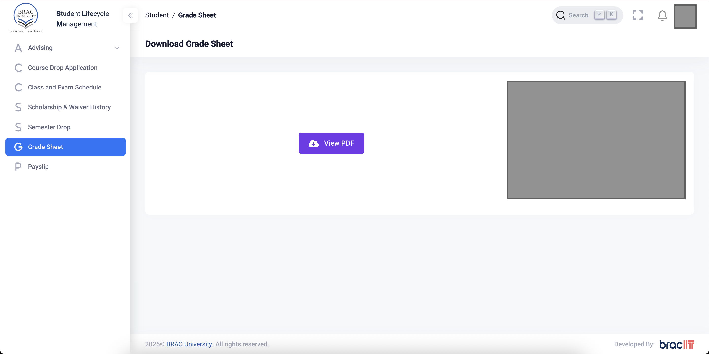

# Stop Downloading THE PDF

A browser extension that opens your BRACU grade-sheet PDF directly in the browser instead of downloading it.

> **Note:** This is an unofficial browser extension and is not officially approved or listed on the Chrome Web Store or Firefox Add-ons site, as the approval process takes time. Because of this, you need to use a workaround to install it manually instead of a simple "Add to Chrome/Firefox" button. Sorry for the inconvenience, but here are the detailed steps for your browser below.

## How to Install (for Chrome) _(Recommended)_

1. Download the browser extension's zip file by clicking [here](https://github.com/imtixz/stop-downloading-the-pdf/archive/refs/heads/main.zip).
2. Extract the zip file to any location.
3. Open Google Chrome and go to `chrome://extensions`.
4. Turn on **Developer mode** (top right corner).
5. Click **Load unpacked**.
6. Select the folder you extracted in step 2 (the one with `manifest.json` inside).
7. Done! Now visit your BRACU dashboard and you'll find that the download button has turned into a view PDF button.

If you want to remove the extension later on, just delete it from the Chrome extensions page.

## How to Install (for Firefox) 

> **Note:** Installing the extension in Firefox is not recommended, as it is very inconvenient. The extension will be removed every time you close Firefox, so you'll need to repeat step (3-5) each time you open firefox.

1. Download the browser extension's zip file by clicking [here](https://github.com/imtixz/stop-downloading-the-pdf/archive/refs/heads/main.zip).
2. Extract the zip file to any location.
3. Open Firefox and go to `about:debugging#/runtime/this-firefox`.
4. Click **Load Temporary Add-on...**
5. Select the `manifest.json` file from the folder you extracted in step 2.
6. Done! Now visit your BRACU dashboard and you'll find that the download button has turned into a view PDF button.